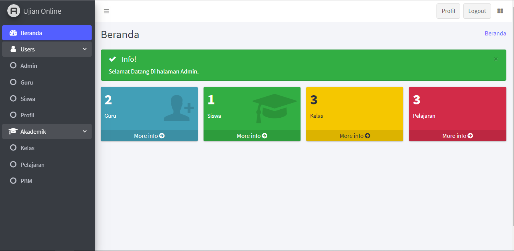
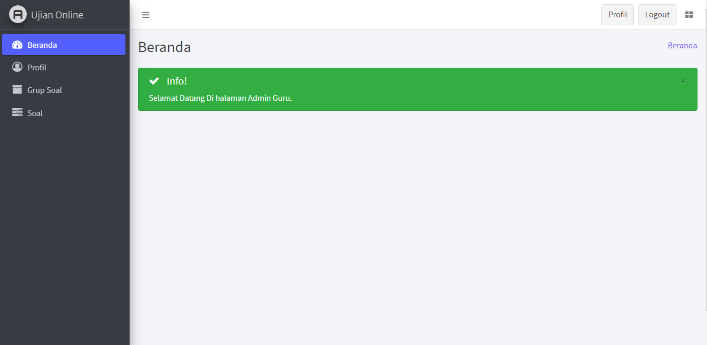
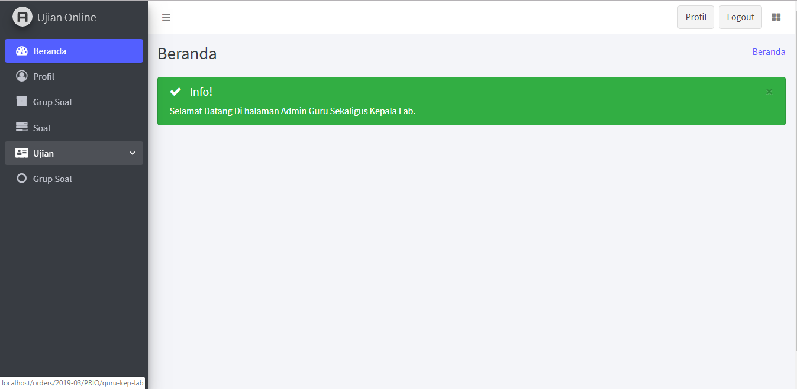

# Web Ujian Online Siswa

# Login

    * Admin         (   username= "admin" password="admin" )
    * Guru          (   username= "196203211984032009" password="guru" mapel="bahasa indonesia kelas IX A")
    * Kepala Lab    (   username= "197108271995122001" password="guru" )
    * Siswa         (   username= "10704" password="siswa" )
    * Siswa         (   username= "10705" password="siswa" )

# cara install:
- clone or download
- download zip
- extract zip and move or copy to your xampp directory
- create new database on your phpmyadmin or sqlYog  with name "prio_ta"
- Importt database, sql file : "{project_path}/sql_dump/prio_ta.sql"

# SS Login Page:

# SS Admin Dashboard:

# SS Guru Dashboard:

# SS Guru Kepala Lab Dashboard:
